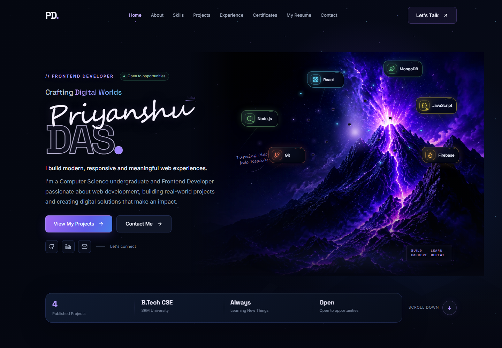

# Priyanshu Das — Portfolio and Admin CMS

A responsive React portfolio, a separate React admin dashboard, and an Express/MongoDB API. The public site keeps local fallback content so it remains usable while the CMS services are being configured.



## Applications

| App              | Development URL                     | Purpose                                                                  |
| ---------------- | ----------------------------------- | ------------------------------------------------------------------------ |
| Public portfolio | `http://127.0.0.1:5173`             | Animated portfolio, projects, resume and contact form                    |
| Admin dashboard  | `http://127.0.0.1:5174/admin/login` | Secure publishing, media, resume, settings and message management        |
| Express API      | `http://127.0.0.1:3001`             | Public content, admin CRUD, uploads, authentication and contact delivery |

The admin dashboard is a separate application under `admin/`; it is not linked from the public navigation.

## Verified Personal Links

- GitHub: `https://github.com/PriyanshuDas0015`
- LinkedIn: `https://www.linkedin.com/in/priyanshu-das-63259b216`
- Email: `priyanshudassonu@gmail.com`

## Local setup

Node.js 22.12 or newer is required. From the project root:

```powershell
npm install
Copy-Item frontend/.env.example frontend/.env
Copy-Item admin/.env.example admin/.env
Copy-Item backend/.env.example backend/.env
npm run dev
```

The root development command starts all three applications. You can also start one workspace with `npm run dev -w frontend`, `npm run dev -w admin`, or `npm run dev -w backend`.

The public site works immediately with local fallback content. CMS operations require MongoDB. Image and PDF uploads require Cloudinary. Contact delivery requires MongoDB, SMTP, or both.

## Where to make changes

- To change the public UI manually, work in `frontend/`.
- To change server behavior or API rules, work in `backend/`.
- To manage portfolio content without editing code, open the app in `admin/`.

## Run Public Portfolio

```powershell
npm run dev -w frontend
```

Open `http://127.0.0.1:5173`. With no API available, the page displays its checked-in fallback content.

## Run Backend

```powershell
npm run dev -w backend
```

The API listens on port 3001 by default. `GET /api/health` verifies that the process is running.

## Run Admin Panel

```powershell
npm run dev -w admin
```

Open `http://127.0.0.1:5174/admin/login`. After login, the protected dashboard is available at `http://127.0.0.1:5174/admin/dashboard`. The dashboard requires the API, MongoDB, and an admin account.

## Environment variables

Frontend and admin variables are public build-time values. Never put credentials in a `VITE_` variable.

| File / variable                                                        | Purpose                                                       |
| ---------------------------------------------------------------------- | ------------------------------------------------------------- |
| `frontend/.env` → `VITE_API_URL`                                       | Deployed API origin; empty uses same-origin `/api` requests   |
| `frontend/.env` → `VITE_SITE_URL`                                      | Canonical public site origin                                  |
| `admin/.env` → `VITE_API_URL`                                          | Deployed API origin for the dashboard                         |
| `admin/.env` → `VITE_PUBLIC_URL`                                       | Public portfolio URL opened by **View Portfolio**             |
| `API_PROXY_TARGET`                                                     | Local Vite proxy target; defaults to port 3001                |
| `backend/.env` → `MONGODB_URI`                                         | MongoDB connection string                                     |
| `JWT_SECRET`                                                           | Long random secret used to sign admin sessions                |
| `ADMIN_USERNAME`, `ADMIN_EMAIL`, `ADMIN_PASSWORD`                      | Credentials consumed by the non-interactive admin seed script |
| `FRONTEND_URL`, `ADMIN_URL`                                            | Comma-separated browser origins allowed by CORS               |
| `CLOUDINARY_CLOUD_NAME`, `CLOUDINARY_API_KEY`, `CLOUDINARY_API_SECRET` | Server-side image and PDF upload credentials                  |
| `SMTP_*`, `CONTACT_RECEIVER_EMAIL`                                     | Optional email notification settings                          |
| `TRUST_PROXY_HOPS`                                                     | Trusted reverse-proxy count; leave `0` locally                |

Use a unique `JWT_SECRET` and an admin password of at least 12 characters. The session token is stored in an HTTP-only, same-site cookie and becomes secure in production.

## MongoDB Setup

Create a MongoDB Atlas database or use a local MongoDB server, create a least-privilege database user, and put its connection string in `backend/.env` as `MONGODB_URI`. Restart the API after changing it. The project does not substitute a fake persistence layer when MongoDB is unavailable.

## Cloudinary Setup

Create a Cloudinary account and copy the cloud name, API key, and API secret into the three `CLOUDINARY_*` values in `backend/.env`. Keep the API secret on the backend. The API limits and transforms project images before storing their returned URLs in MongoDB; resume PDFs use Cloudinary raw-file storage.

## Seed the CMS

After setting `MONGODB_URI`:

```powershell
npm run seed
npm run seed:admin
```

`npm run seed` upserts the supplied portfolio projects, skills, experience, education, services, section controls, identity and SEO settings. It can be run again without intentionally duplicating content records. `npm run seed:admin` upserts the configured admin account and hashes its password with bcrypt.

## Create Admin Account

Set `MONGODB_URI` and `JWT_SECRET` in `backend/.env`, then run the interactive command from the project root:

```powershell
npm run create-admin
```

Or run the exact backend command:

```powershell
cd backend
npm run create-admin
```

It asks for a username, email, and password. Password input is masked, must contain at least 12 characters, and is stored only as a bcrypt hash. Sign in with either the username or email at `http://127.0.0.1:5174/admin/login`.

For non-interactive deployments, set `ADMIN_USERNAME`, `ADMIN_EMAIL`, and `ADMIN_PASSWORD` and run `npm run seed:admin`. Remove the plain password from the deployment environment after seeding if your operating process allows it.

No resume PDF was present in the supplied task files, so the repository does not invent or ship one. Sign in at `/resume` in the admin dashboard and upload the real PDF to activate the public **View Resume** and **Download Resume** actions.

## Update Resume

Open **Resume** in the admin sidebar, choose a PDF up to 10 MB, review its filename and size, and click **Upload Resume**. Uploaded versions remain in history; you can activate an earlier version or delete an inactive version.

## Add Project

Open **Projects**, click **Add Project**, complete the required title, role and description, choose its draft/published state, and optionally add a cover, logo, gallery, or demo video. Leave GitHub or live URLs empty until verified; the public site never creates fake `#` links.

## Add Certificate

Open **Certificates**, click **Add Certificate**, and enter its title and issuer. You can include a credential link, image, PDF, skills, issue date, featured state, display order, and draft/published state. Published certificates appear in the public Certificates section.

## Manage Site Structure

Open **Website Settings** to show or hide public sections, choose navbar links, change section order, edit the logo and browser metadata, configure social-preview fields, and publish an optional announcement. Hero and About have their own editors for CTA targets, badges, paragraphs, and feature cards.

## Add Skill

Open **Skills**. Create a category when needed, then click **Add Skill**, choose its category, icon, optional proficiency percentage, color and display order, and save. Existing skills and categories can be edited or deleted from the same page.

## View Messages

Open **Messages** to search and filter contact submissions. Opening a message marks it read; rows support read/unread state, archive, email reply, and confirmed deletion. The sidebar badge shows the unread total.

## CMS capabilities

- Dashboard counts for projects, skills, certificates and messages, plus quick actions.
- Login, session checking, logout and protected admin routes.
- Combined Profile/About management for name, role, introductions, public contact details, and profile photo; separate advanced Hero and About editors remain available.
- Project CRUD with slugs, ordering, draft/published state, URLs, tags, cover, logo, gallery and video.
- Skill category and skill CRUD with visibility, level, and optional proficiency percentage.
- Experience CRUD with company, position, dates, current role state and technologies; multiple education records with optional grade/CGPA.
- Certificate CRUD with images, PDFs, credential links and publishing controls.
- Resume PDF history with active-version controls.
- Searchable media library with safe in-use deletion checks.
- Contact-message inbox with read, unread and archived states.
- Public section visibility, navbar membership and display ordering.
- Site identity, SEO/social metadata, announcements and admin account/password management.
- Responsive collapsible sidebar, confirmations, upload progress, validation, error states and toasts.

Public portfolio content is fetched from `/api/public/*`. Each section falls back to checked-in content when the API is unavailable, so an unconfigured database does not erase the site.

## Media and Git Ignore Strategy

Uploads go directly from the Express API to Cloudinary using in-memory Multer storage. They are not committed to Git.

- Project covers, logos, gallery images and certificate images: PNG, JPEG or WebP, maximum 5 MB each.
- Profile photo: PNG, JPEG or WebP, maximum 5 MB.
- Demo videos: MP4 or WebM, maximum 50 MB.
- Certificate PDFs: PDF only, maximum 10 MB.
- Resume: PDF only, maximum 10 MB.
- Replacing media deletes the previous Cloudinary asset after the new asset is accepted.
- Upload directories and common video files are ignored in `.gitignore`.
- Cloudinary credentials stay only in `backend/.env` or the deployment provider's secret store.

## Project structure

```text
frontend/             public React portfolio
  src/context/        API content provider with local fallbacks
  src/components/     portfolio sections and interactions
  tests/              responsive, behavior and accessibility tests
admin/                independent React admin dashboard
  src/pages/          dashboard and content managers
  src/services/       authenticated admin API client
  tests/              login, CRUD, upload and mobile workflow tests
backend/              Express API
  src/models/         MongoDB content, certificate, media, admin, resume and message schemas
  src/controllers/    public content, auth, CRUD, uploads and dashboard logic
  src/routes/         public and protected route groups
  src/scripts/        content and non-interactive admin seed scripts
  scripts/            interactive admin account creation
docs/                 validation notes and browser screenshots
```

## Build and verification

```powershell
npm run build
npm test
npm run test:admin
npm run test:browser
npm run format:check
```

`npm run build` writes `frontend/dist` and `admin/dist`. The public browser suite expects the public Vite server and API to be running; `npm run dev` provides both. The admin suite starts or reuses its own Vite server.

The test suites cover API security and validation, admin authentication and content workflows, responsive layouts at 1440/1024/768/430/390/375 pixels, navigation, project filters, resume state, contact feedback, reduced motion, keyboard behavior, and axe accessibility rules. See [validation notes](docs/VALIDATION.md) for the latest local results and limits.

## Deployment

Deploy the public site, admin dashboard and API as separate services. Configure both browser apps with the API HTTPS origin. Configure the API with both deployed browser origins, MongoDB, JWT, Cloudinary, and optional SMTP secrets. Seed content and the admin only after production secrets are set.

After deployment, verify `/api/health`, admin login, one image upload, the real resume upload/download flow, public content loading, and a contact submission. The project has not been published or connected to external service accounts from this workspace.
